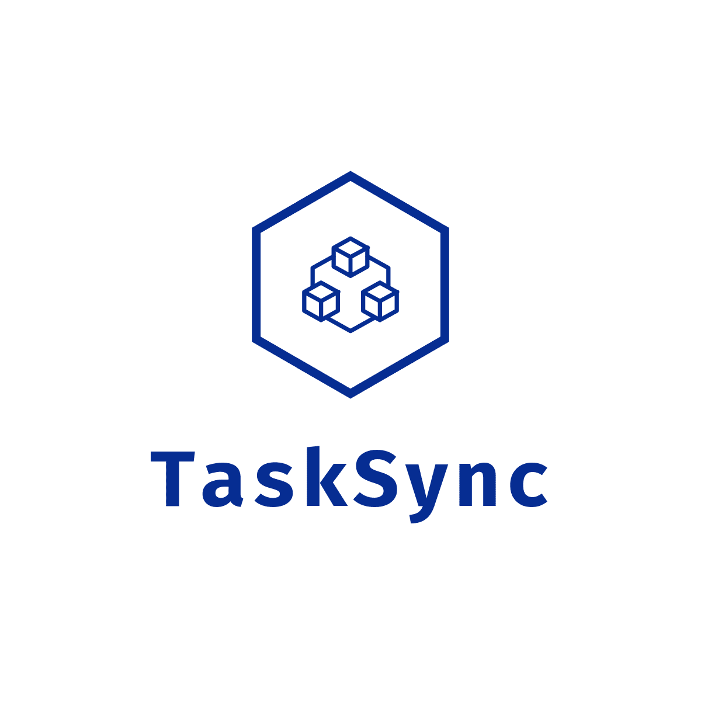

TaskSync es una plataforma colaborativa de gestión de tareas diseñada para ayudar a los equipos a crear, asignar y gestionar tareas de manera eficiente, con funcionalidades como autenticación de usuarios, control de acceso basado en roles, notificaciones automáticas y visibilidad de tareas según grupos.

## Funcionalidades

- **Autenticación de Usuarios**: Inicio de sesión y registro seguro utilizando JWT para autenticación basada en tokens.
- **Creación y Asignación de Tareas**: Crea tareas y asígnalas fácilmente a los miembros del equipo.
- **Notificaciones Automáticas**: Recibe notificaciones en tiempo real para eventos importantes (como la asignación de tareas).
- **Control de Acceso Basado en Roles (RBAC)**: Gestiona el acceso con roles y permisos para diferentes usuarios.
- **Visibilidad de Tareas por Grupo**: Controla la visibilidad de tareas basadas en los grupos de usuarios.
- **Diseño Responsivo**: Interfaz amigable para el usuario y accesible en todos los dispositivos.

## Tecnologías

- **Frontend**: React.js, Tailwind CSS
- **Backend**: Node.js, Express.js
- **Base de Datos**: MongoDB, Mongoose
- **Autenticación**: JSON Web Tokens (JWT)
- **Notificaciones**: Nodemailer
- **Gestión del Proyecto**: Jira, metodología Scrum

## Estructura del Proyecto

```bash
TaskSync/
│
├── backend/         # Backend con Node.js y Express, integrado con MongoDB
│   ├── config/      # Configuración de la base de datos y variables de entorno
│   ├── controllers/ # Lógica para manejar solicitudes (auth, tareas, etc.)
│   ├── models/      # Esquemas de MongoDB para usuarios, tareas, etc.
│   ├── routes/      # Rutas de la API
│   ├── utils/       # Funciones utilitarias (notificaciones, JWT, etc.)
│   └── app.js       # Punto de entrada del backend
│
├── frontend/        # Frontend con React y UI para la gestión de tareas
│   ├── src/
│   │   ├── components/ # Componentes reutilizables (login, formularios de tareas, etc.)
│   │   ├── pages/      # Páginas de la aplicación (tablero, vista de tareas, etc.)
│   │   ├── services/   # Llamadas a la API y gestión de estado (ej., Redux)
│   │   └── App.js      # Punto de entrada del frontend
│
└── README.md        # Documentación del proyecto
```

## Instalación

1. **Clonar el repositorio**

   ```bash
   git clone https://github.com/N4him/TASKSYNC.git
   cd TaskSync
   ```

2. **Configurar el Backend**

   - Navega a la carpeta `backend/`.
   - Instala las dependencias:

     ```bash
     cd backend
     npm install
     ```

   - Configura las variables de entorno creando un archivo `.env`:

     ```
     MONGO_URI=tu-string-de-conexión-mongodb
     PORT=5000
     JWT_SECRET=tu-clave-secreta
     EMAIL_USER: tu cuenta publica para notificaciones
     EMAIL_PASS: la contraseña de tu cuenta
     
     ```

   - Inicia el servidor del backend:

     ```bash
     npm start
     ```

3. **Configurar el Frontend**

   - Navega a la carpeta `frontend/`.
   - Instala las dependencias:

     ```bash
     cd frontend
     npm install
     ```

   - Inicia el servidor de desarrollo del frontend:

     ```bash
     npm run dev
     ```

4. **Acceder a la aplicación**

   - Visita `http://localhost:3000` para acceder al frontend.
   - El backend estará ejecutándose en `http://localhost:5000`.

## Uso

- **Inicio de sesión/Registro**: Los nuevos usuarios pueden registrarse o iniciar sesión para acceder a sus tareas.
- **Gestión de Tareas**: Los usuarios lideres o administradores pueden crear, asignar, editar y eliminar tareas dentro de sus equipos.
- **Notificaciones**: Los usuarios reciben notificaciones cuando se asignan tareas.
- **Visibilidad por Grupos**: La visibilidad de las tareas es controlada por los grupos de usuarios, asegurando que cada usuario vea solo las tareas relevantes de su respectivo grupo.

## Contribuir

¡Las contribuciones son bienvenidas! Sigue estos pasos para contribuir:

1. Haz un fork del repositorio.
2. Crea una nueva rama para tu feature (`git checkout -b nombre-feature`).
3. Haz commit de tus cambios (`git commit -m 'Añadir una nueva funcionalidad'`).
4. Haz push de la rama (`git push origin nombre-feature`).
5. Abre un pull request.

## Licencia

Este proyecto está bajo la licencia MIT - consulta el archivo [LICENSE](LICENSE) para más detalles.

## Contacto

Si tienes alguna pregunta o sugerencia, no dudes en contactarme:

- **Email**: n4ahim180@gmail.com
- **GitHub**: https://github.com/N4him

---
